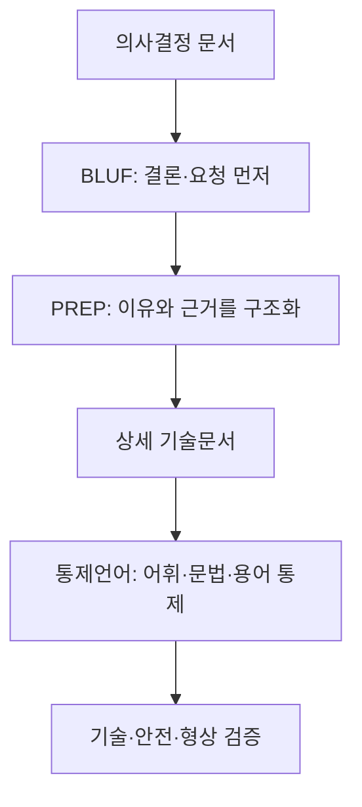

<!-- 시험 원고 01 · 입력: 긴 외부 문서(PREP·BLUF·ASD-STE100 보고서) · 읽기용 미리보기. 노션 문법은 references/notion-format.md -->

# 🧭 PREP·BLUF·통제언어 비교와 한국형 정비 언어 설계

> **🎯 결론**
>
> **1. PREP와 BLUF는 경쟁 기법이 아니다.**
> PREP는 주장을 펼치는 순서를, BLUF는 결론의 위치를 정한다.
>
> **2. 두 기법은 실무 근거가 강하다.**
> 반면 기법 자체를 검증한 직접 실험 근거는 빈약하다.
>
> **3. STE100의 전신(Simplified English)은 현직 정비사 175명 실험에서 이해도를 높였다.**
> 한국형 정비 언어는 직역하지 말고, 생략 허용과 문장 길이 기준을 실험으로 새로 정해야 한다.

_맥락: 출처 사용자가 준 조사 보고서(2026-10-09 받음) · 왜 노션 저장 스킬 재설계의 기준_
_용어: PREP = 결론→이유→예시→결론 순서로 말하는 구조 · BLUF = 결론을 맨 앞에 두는 원칙 · STE100 = 기술문서의 단어·문장을 제한한 국제 영어 표준(항공정비에서 출발)_

---

## 1. 세 체계의 차이 — 막는 실패가 각각 다르다

셋 다 독자가 할 추론을 작성자가 대신하게 만든다. 다만 막는 실패가 다르다.

| 구분 | PREP | BLUF | 통제언어(STE100) |
| :--- | :--- | :--- | :--- |
| 본질 | 논증 구조 | 정보 순서 원칙 | 어휘·문법을 제한한 기술문서 표준 |
| 핵심 질문 | 왜 이 결론인가? | 결론·요청이 무엇인가? | 다르게 해석할 여지가 있는가? |
| 쓰는 곳 | 발표, 답변, 설득 | 보고, 이메일, 의사결정 | 절차서, 작업카드, 정비 문서 |
| 가장 큰 위험 | 사례 하나가 근거를 대신함 | 결론을 앞에 두다 조건을 지움 | 규칙 준수를 안전으로 착각함 |

- PREP는 Toastmasters가 가르치는 교육 기법이다. 국제 표준은 아니다.
- BLUF는 미 육군 규정 AR 25‑50이 "main point at the beginning"으로 요구한다.
- STE100은 ASD가 유지하는 국제 표준이다. 현행 Issue 9는 2025-01-15에 나왔다. 작성 규칙 53개와 승인 일반어 약 900개를 담는다.

---

## 2. 함께 쓰는 법 — 결론은 BLUF, 설명은 PREP, 절차는 통제언어

세 체계는 층이 달라서 겹쳐 쓸 때 가장 자연스럽다.

_위 흐름은 보고서의 계층 구조 그림을 옮긴 것이다. 맨 아래 검증 층은 어떤 글쓰기 형식으로도 대신할 수 없다._

- 예: 정비 절차 개선안을 올릴 때 첫 문장은 BLUF로, 설명은 PREP로, 첨부 절차는 통제언어로 쓴다.

---

## 3. 근거의 세기 — 직접 실험이 있는 건 정비 언어뿐이다

PREP와 BLUF는 인지과학과 잘 맞는다. 하지만 그 이름 자체를 검증한 실험은 확인되지 않았다.

| 분야 | 실무·규범 근거 | 직접 실험 근거 | 보고서 판단 |
| :--- | :--- | :--- | :--- |
| PREP | 강함. Toastmasters가 오래 사용 | 제한적 | 유용한 구조화 요령. 과학적 최적 공식으로 과장하지 않는다 |
| BLUF | 매우 강함. 미군 공식 작성 규정 | 제한적 | 시간이 급한 업무 문서에 강하다 |
| 통제언어 | 매우 강함. 산업 표준과 유지관리 조직 | 전신(Simplified English) 정비사 175명 실험, FAA 지침이 정리한 시험들 | 셋 가운데 가장 직접적인 실증 근거 |

- **간접 근거:** 작업기억은 용량이 작다(Baddeley, Cowan). 독자는 세부 문장을 쌓지 않고 큰 구조부터 잡는다(Kintsch·van Dijk). 두 연구는 "결론 먼저"를 지지한다. 다만 PREP·BLUF를 직접 실험한 것은 아니다.
- **흔한 과장:** "PREP는 네 단계라 작업기억에 딱 맞는다"는 주장은 근거가 없다.
- **175명 실험(Chervak·Drury·Ouellette, 1996):** 작업카드 16종을 썼다. 어려운 카드와 영어가 모국어가 아닌 정비사에게서 효과가 특히 컸다. 레이아웃을 바꾼 효과는 유의하지 않았다.
- **FAA 지침:** STE가 작업카드 이해 오류를 크게 줄였다고 정리한다. 효과의 크기 숫자는 제시하지 않는다.

---

## 4. 통제언어 — 쉬운 단어가 아니라 해석의 여지를 없애는 것이다

통제언어(CNL)는 자연어를 바탕으로 어휘·문법·의미를 일부러 제한한 언어다.

- **원리:** 한 개념에는 승인된 한 단어만 쓴다. start·begin·commence를 섞지 않는다. 한 문장에는 지시 하나만 둔다.
- **예시:** 보고서의 시제품 문장이다.

| 모호한 문장 | 통제문장 |
| :--- | :--- |
| 점검 후 이상이 없으면 해당 커버를 적절하게 장착하고 필요한 경우 볼트를 충분히 조인 후 반대쪽도 동일하게 실시한다. | 커버 C1을 육안 검사한다. / 커버 C1에 균열이 있으면 작업을 중지한다. / 균열이 없으면 커버 C1을 장착한다. / 볼트 B1\~B4를 25 N·m로 조인다. / 좌측 커버 C1을 검사한다. / 우측 커버 C1을 검사한다. |

- **흔한 오해 1:** 짧은 문서가 좋은 문서다. 절차를 빠짐없이 쓰면 문서가 조금 길어진다. 그래도 총 인지 비용은 줄 수 있다.
- **흔한 오해 2:** 규칙만 지키면 안전하다. "볼트를 250 N·m로 조인다"는 완벽한 통제문장이다. 그러나 올바른 값이 25 N·m라면 위험한 문장이다. 통제언어는 모호성을 줄일 뿐 기술적 사실을 판정하지 않는다.
- **흔한 오해 3:** 통제언어는 문장을 짧게 만드는 것이다. 1982\~2024년 정비 매뉴얼을 분석한 연구(Wang·Friginal, 2026)는 구문 복잡성이 한 방향으로 줄지 않았다고 보고했다.

---

## 5. 한국형 설계 — 번역이 아니라 실험으로 기준을 새로 만든다

STE100을 한국어로 직역하면 안 된다. 영어 규칙이 한국어의 문법 특성을 다루지 못하기 때문이다.

- **생략:** 한국어는 주어·목적어 생략이 정상 문법이다(국립국어원). 그래서 "문법상 가능한 생략"과 "작업상 허용되는 생략"을 따로 정해야 한다. 기준은 "두 사람이 독립적으로 같은 작업을 고르는가"다.
- **문장 길이:** 영어의 20/25단어 제한을 어절 수로 옮기는 것은 표준화가 아니라 숫자 번역이다. 어절 수, 절 수, 서술어 수, 행동 수 가운데 무엇이 실제 이해 오류를 예측하는지 실험해야 한다.
- **어휘 규모:** 영어판의 약 900단어를 한국어판 목표로 삼지 않는다. 적정 규모는 코퍼스와 이해도 실험으로 정한다.
- **어휘 구조:** 일반 통제어휘와 승인 기술용어를 나눈다. 한 부품에 이름이 여럿이면 작성용 표준 명칭 하나를 정하고, 나머지는 검색용 별칭으로만 남긴다.

**한국형 핵심 규칙 (보고서 제안)**

| 영역 | 규칙 |
| :--- | :--- |
| 행동 | 한 문장에 핵심 작업 하나 |
| 대상 | 부품·위치를 이름으로 명시 ("이것·해당 부품" 최소화) |
| 조건 | 조건을 먼저, 행동을 뒤에 |
| 모호어 | 적절히·충분히·필요시·등은 판단 기준이 없으면 금지 |
| 수치 | 값·단위·허용 범위 명시 |
| 좌우 | 좌측·우측을 각각 명시("반대쪽도 동일" 금지) |
| 안전 | 경고를 관련 행동 바로 앞에 배치 |

---

## 6. 개발 절차 — 발행 전에 검증 6단계를 거친다

기간 24\~36개월과 상시 인력 8\~12명은 표준이 정한 값이 아니다. 보고서 자체의 추정치다.

1. **코퍼스 검증:** 국내 작업카드의 용어 빈도, 동의어, 문장 길이, 생략 패턴을 분석한다.
2. **언어 적합성:** 작성자와 언어 전문가가 같은 문장을 따로 코딩해 규칙 해석의 일치도를 잰다.
3. **자동 검사기:** 금지어·동의어·다중 서술어 탐지의 정밀도·재현율을 잰다. 검사기는 언어 적합성만 보고, 기술적 사실은 판정하지 않는다.
4. **A/B 이해도 시험:** 같은 내용을 일반 한국어와 통제 한국어로 써서 정비사에게 무작위로 보여 준다.
5. **모의 정비 수행:** 순서 오류, 부품 선택 오류, 누락, 질문 횟수, 작업 시간을 잰다.
6. **안전·형상 독립 심사:** 토크·공차·부품 번호·위험 통제는 공학·품질·안전 조직이 따로 승인한다.

- ASD는 STE 검사기나 AI 도구를 공식 인증하지 않는다. 생성형 AI는 작성 보조로만 쓰고, 최종 정확성을 인증하는 주체로 두지 않는다.

---

원문 위치

- 경영진 요약 → 결론 상자
- 세 체계의 비교 프레임, PREP 장, BLUF 장 → 1번 블록
- 통합 적용과 실행 프레임 → 2번 블록
- 종합 평가와 핵심 연구과제 → 3번 블록
- 항공정비 통제언어와 ASD‑STE100 → 4번 블록
- 한국형 항공정비 통제언어 설계 방법론 → 5·6번 블록

출처

- 사용자가 준 보고서 「PREP·BLUF·항공정비 통제언어의 구조와 효과」(2026-10-09 받음).
- 보고서가 꼽은 1차 자료: ASD‑STE100 Issue 9, ASD STEMG 변경관리 규정, FAA Human Factors Guide for Aviation Maintenance and Inspection, 미 육군 AR 25‑50, 미 공군 The Tongue and Quill, Toastmasters PREP 자료, Kuhn의 통제자연어 분류 연구, Chervak·Drury·Ouellette(1996), 국립국어원 문장성분·생략 자료.
- 각 자료의 URL은 확인하지 못했다. 보고서의 인용 표시가 링크로 바뀌지 않은 채 전달됐다.

조사 원자료

**PREP 작성 틀**
- P: 내가 제안·판단하는 것은 \_\_\_이다.
- R: 가장 중요한 이유는 \_\_\_이다.
- E: 이를 보여 주는 근거·사례·수치는 \_\_\_이다.
- P: 따라서 \_\_\_해야 한다.

**BLUF 작성 틀**
- 결론·요청: 누가 무엇을 언제까지 해야 하는가.
- 이유: 왜 필요한가.
- 핵심 근거: 결론을 바꿀 수 있는 가장 중요한 사실·수치.
- 위험·조건: 예외, 불확실성, 의존 조건.
- 다음 행동: 승인·결정·회신할 사항.

**한국형 개발 단계별 기간 (보고서 자체의 추정치)**

| 단계 | 기간 | 산출물 |
| :--- | :--- | :--- |
| 범위·거버넌스 설정 | 2\~3개월 | 헌장, 문서 범위, 안전 요구 |
| 코퍼스·용어 수집 | 4\~6개월 | 정비 코퍼스, 용어 DB |
| 어휘·문법 Issue 0 | 6\~9개월 | 통제 사전, 작성 규칙 |
| 검사도구 시제품 | 6\~9개월(병행) | 규칙 검사기 |
| 언어·인적요인 파일럿 | 4\~6개월 | 이해도·사용성 결과 |
| 현장 수행 검증 | 6\~9개월 | 작업 오류·시간·문의 데이터 |
| 독립 심사·Issue 1 | 3\~6개월 | 정식 초판 |

